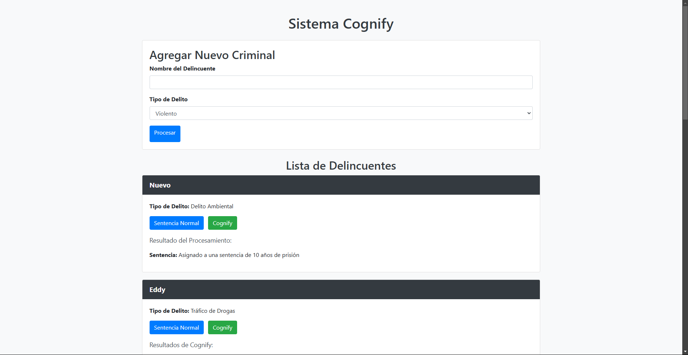
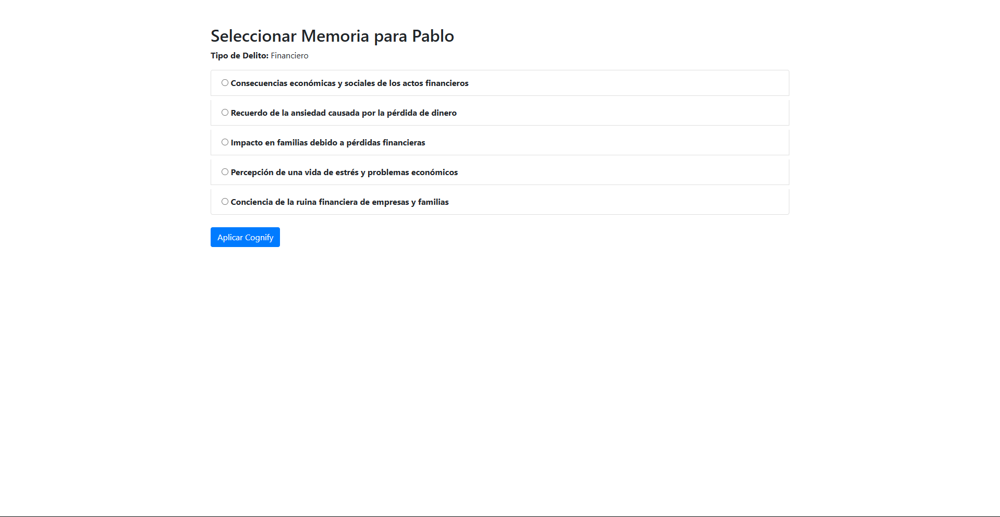
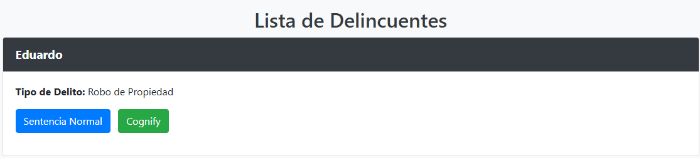

# Cognify

### Alumnos:
- **Emiliano Garcia Cordero** - 20211779
- **Martinez Garcia Gabriel Stoyko** - 20211808
- **Sanchez Salinas Eduardo Josue** - 20210637

### Profesor:
**René Solis R.**

---

Fecha de entrega: Martes 12 de noviembre.


# Diagramas UML (MODELO, VISTA Y CONTROLADOR)
## Modelo

```markdown
+-------------------+
|     CrimeType     |  (Enumeración)
+-------------------+

+-------------------+            +-------------------+
|      Memory       |            |   MemoryFactory   |
+-------------------+            +-------------------+
| - description     |            | + get_memories()  |
| - empathy         |            +-------------------+
| - remorse         |
| - impact          |
+-------------------+
| + __init__()      |
+-------------------+

+-------------------+            +-------------------+
|     Criminal      |<>---------1|   MemoryModel     |
+-------------------+ 1        * +-------------------+
| - id              |            | - id              |
| - name            |            | - description     |
| - crime_type      |            | - empathy         |
| - sentencia       |            | - remorse         |
|                   |            | - impact          |
+-------------------+            | - criminal_id     |
                                +-------------------+

+-------------------+
| SimulationConfig  | (Singleton)
+-------------------+
| - settings        |
+-------------------+
| + set_setting()   |
| + get_setting()   |
+-------------------+
```
En el Modelo, las clases principales son CrimeType, Memory, MemoryFactory, Criminal, MemoryModel y SimulationConfig. CrimeType es una enumeración que define los tipos de delitos. Memory representa recuerdos con atributos como descripción, empatía y remordimiento. MemoryFactory genera listas de recuerdos basados en el tipo de delito. Criminal es un modelo de base de datos que tiene una relación uno a muchos con MemoryModel, indicando que un criminal puede tener múltiples recuerdos asociados. SimulationConfig es un singleton que gestiona la configuración de la simulación.

## Vista

```markdown
+-------------------+
|       Vista       |
+-------------------+
| + mostrar_menu_principal()    |
| + seleccionar_tipo_delito()   |
| + mostrar_recuerdo(recuerdo)  |
+-------------------+
```
La clase Vista es responsable de la interacción con el usuario. Contiene métodos estáticos como mostrar_menu_principal, seleccionar_tipo_delito y mostrar_recuerdo. Estos métodos presentan opciones al usuario y muestran información relevante. La Vista no tiene relaciones directas con otras clases en el diagrama simplificado, ya que su función es servir de interfaz entre el usuario y el sistema, mostrando datos y capturando entradas.

## Controlador

```markdown
+-------------------+          +-------------------+
|  CriminalForm     |          |  CriminalService  |
+-------------------+          +-------------------+
| - name            |          | + create_criminal()|
| - crime_type      |          | + apply_normal_sentence()|
| - submit          |          | + get_all_criminals()|
+-------------------+          +-------------------+

Flask Routes:
- /criminals -> list_criminals()
- /process_criminal/<id> -> process_criminal()
- /select_memory/<id> -> select_memory()
```
En los Controladores, destacan las rutas de Flask y la clase CriminalForm. Las rutas incluyen funciones como list_criminals, process_criminal y select_memory, que manejan solicitudes HTTP y coordinan la lógica de la aplicación. CriminalForm es un formulario que permite crear nuevos criminales con campos como nombre y tipo de delito. Los controladores interactúan con el Modelo a través de servicios como CriminalService, facilitando la comunicación entre la Vista y el Modelo y gestionando el flujo de datos y operaciones de negocio.

# Análisis del Impacto Social y Técnico del Sistema

---

## Impacto Social

### Rehabilitación Efectiva de Delincuentes

El sistema "Cognify" tiene el potencial de transformar el proceso de rehabilitación al inducir sentimientos de empatía y remordimiento en los delincuentes. Al exponer a los individuos a recuerdos que reflejan las consecuencias de sus acciones, se promueve una comprensión más profunda del impacto de sus delitos en las víctimas y la sociedad. Esta aproximación puede contribuir significativamente a reducir las tasas de reincidencia y facilitar la reintegración exitosa de los delincuentes en la comunidad.

### Conciencia y Educación Social

Además de su función rehabilitadora, Cognify puede servir como una herramienta educativa que aumente la conciencia pública sobre las repercusiones de diversos delitos. Al destacar los efectos negativos de las acciones delictivas, el sistema puede influir positivamente en la prevención del crimen y fomentar una cultura de responsabilidad y respeto hacia los demás.

### Consideraciones Éticas y Derechos Humanos

La implementación de tecnología que afecta directamente la cognición humana plantea importantes cuestiones éticas. Es fundamental garantizar que el sistema respete la autonomía y los derechos individuales de los delincuentes. Cualquier intervención debe llevarse a cabo con el consentimiento informado de los involucrados, y es imprescindible establecer límites claros para evitar posibles abusos o manipulaciones indebidas.

### Aceptación y Confianza Pública

La percepción social del uso de tecnología para influir en la mente de los individuos puede variar ampliamente. Es esencial promover la transparencia en el funcionamiento del sistema y fomentar el diálogo público para abordar preocupaciones y construir confianza. El desarrollo de políticas y regulaciones adecuadas será crucial para garantizar la legitimidad y aceptación de "Cognify" en la sociedad.

---

## Impacto Técnico

### Innovación Tecnológica y Desarrollo Modular

Cognify emplea tecnologías modernas como Flask y SQLAlchemy, y sigue el patrón de diseño Modelo-Vista-Controlador (MVC), lo que facilita su mantenimiento y escalabilidad. La arquitectura modular del sistema permite incorporar nuevos tipos de delitos y recuerdos de manera eficiente, adaptándose a las necesidades cambiantes y facilitando futuras expansiones.

### Seguridad y Protección de Datos

El manejo de información sensible requiere la implementación de medidas de seguridad robustas. Es imperativo asegurar la confidencialidad, integridad y disponibilidad de los datos personales de los delincuentes y de los recuerdos asignados. Esto incluye el uso de técnicas de cifrado, autenticación sólida y cumplimiento con regulaciones de protección de datos, como el GDPR o leyes locales aplicables.

### Integración y Compatibilidad con Sistemas Existentes

Para maximizar su eficacia, Cognify debe ser compatible e integrarse adecuadamente con los sistemas penitenciarios y de gestión existentes. Esto puede implicar desafíos técnicos relacionados con la interoperabilidad, la migración de datos y la adopción de estándares comunes. Una integración exitosa permitirá una implementación más fluida y una adopción más amplia del sistema.

### Escalabilidad y Rendimiento

A medida que el sistema se expanda y sea adoptado por más instituciones, deberá manejar un aumento en la cantidad de usuarios y volumen de datos sin comprometer el rendimiento. Es necesario diseñar la infraestructura técnica para ser escalable, utilizando prácticas de programación eficientes y posiblemente adoptando soluciones en la nube o tecnologías de microservicios.

### Desarrollo de Algoritmos Avanzados

La asignación efectiva de recuerdos personalizados a cada delincuente requiere el desarrollo de algoritmos sofisticados que puedan considerar múltiples factores, como el tipo de delito, el perfil psicológico y el historial individual. La incorporación de inteligencia artificial y aprendizaje automático puede mejorar la precisión y eficacia del sistema, aunque también agrega complejidad técnica y requiere consideraciones adicionales en cuanto a ética y transparencia algorítmica.

# Pruebas y Resultados de Cognify
### Pantalla de Inicio

La página de inicio de Cognify ofrece una interfaz sencilla para la gestión y rehabilitación de delincuentes. Incluye un formulario donde los usuarios pueden registrar rápidamente a nuevos delincuentes, ingresando su nombre y seleccionando el tipo de delito. Debajo, se presenta una Lista de Delincuentes previamente registrados, mostrando el nombre, tipo de delito y dos opciones de procesamiento: "Sentencia Normal" y "Cognify". La opción Cognify permite aplicar un enfoque de rehabilitación cognitiva que busca desarrollar empatía y comprensión en los delincuentes. Cada registro también muestra los resultados del procesamiento, permitiendo un seguimiento personalizado y facilitando una rehabilitación más humana y efectiva.

### Pantalla de Selección de Memoria

La pantalla de Selección de Memoria en Cognify permite a los usuarios asignar un recuerdo específico a cada delincuente, con el objetivo de fomentar la empatía y reflexión sobre sus acciones. En este caso, se muestra un delincuente llamado "Pablo" con un Tipo de Delito financiero.

La interfaz presenta varias opciones de recuerdos relacionados con el impacto de los delitos financieros, como la "Conciencia de la ruina financiera de empresas y familias" y el "Impacto en familias debido a pérdidas financieras". Cada recuerdo aborda aspectos emocionales y sociales de las consecuencias de estos delitos. Tras seleccionar el recuerdo adecuado, el usuario puede hacer clic en el botón "Aplicar Cognify" para asignar el recuerdo a Pablo, integrando el enfoque de rehabilitación del sistema que ayuda a los delincuentes a comprender el impacto de sus acciones.


### Pantalla de Prueba

En esta pantalla de Lista de Delincuentes del sistema Cognify, se muestra el registro de un delincuente llamado Eduardo con un Tipo de Delito de "Robo de Propiedad".

La interfaz presenta dos opciones de acción: "Sentencia Normal" en azul y "Cognify" en verde. El botón de Sentencia Normal probablemente asigna una sentencia convencional, mientras que el botón Cognify activa el enfoque de rehabilitación cognitiva que caracteriza al sistema, permitiendo trabajar en la empatía y conciencia del impacto de sus acciones en otros. Esta pantalla facilita la elección del tipo de sentencia de manera rápida y eficiente, apoyando la gestión de casos y el seguimiento de los procesos de rehabilitación.
